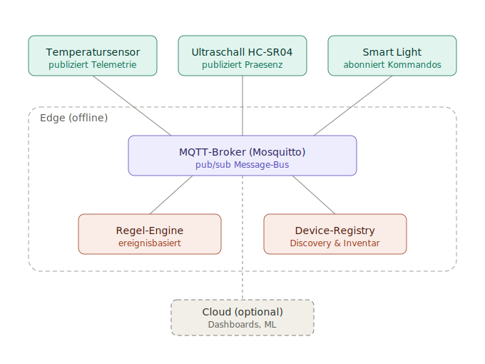
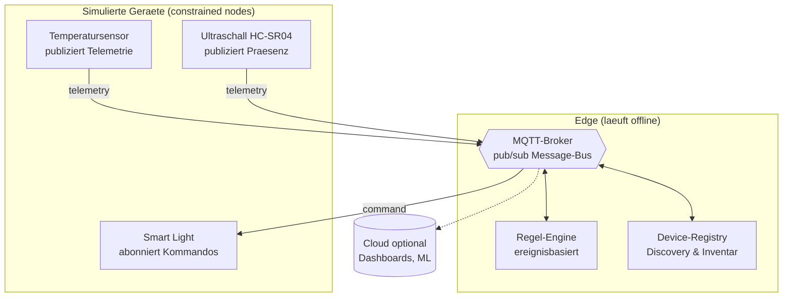

# Architektur

Leitbild: **Message-Bus als Nervensystem.** Alle Komponenten sind eigenstaendige
Prozesse und kommunizieren ausschliesslich ueber den MQTT-Broker. Es gibt keine
direkten Aufrufe zwischen Geraeten — daraus folgt die lose Kopplung, auf der die
uebrigen Qualitaetsmerkmale aufsetzen.

## Nachrichtenfluss am Beispiel

1. `ultrasonic-sensor` publiziert eine Distanz auf
   `home/living_room/ultrasonic/ultra-living-01/telemetry`.
2. Die `rule-engine` ist auf dieses Topic abonniert, leitet Anwesenheit ab und
   publiziert bei Zustandswechsel ein Kommando auf
   `home/living_room/light/light-living-01/command`.
3. Das `smart-light` ist auf sein Kommando-Topic abonniert, schaltet und meldet
   seinen neuen Zustand (retained) auf `.../state`.
4. Die `registry` fuehrt parallel ein Live-Inventar aus den retained
   Announcement- und Availability-Nachrichten.

Sender und Empfaenger kennen einander nie direkt — sie teilen nur den
Schnittstellen-Vertrag (Topic-Schema + JSON-Schemas).
